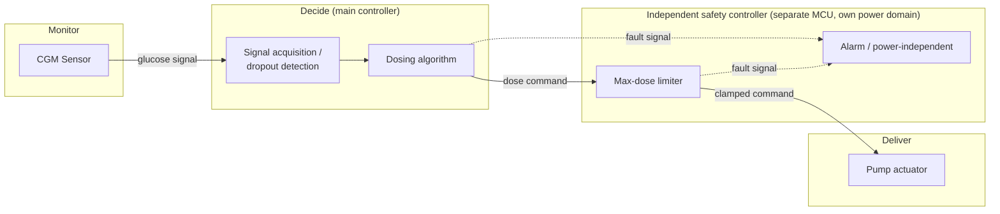

# PEMS Architecture — IEC 60601-1-4

> **Status: Option A selected (see "Decision" below).** See
> [[../../IEC-62304/planning/01-software-safety-classification.md]] and
> [[../essential_performance/00-essential-performance.md]] for what's
> driving these boxes.

## Decision: Option A — Independent safety controller

`LIMIT` and `ALARM` run on a second, physically separate MCU with its
own power domain. Chosen over Option B because it's the only option
that (a) satisfies IEC 62304's independence bar and lets the dosing
algorithm's classification actually be re-argued, and (b) solves the
alarm-under-power-loss hazard (HAZ-010) directly via a separate power
domain, rather than needing a bolt-on battery-backed circuit later that
ends up rebuilding half of Option A anyway.

Cost accepted: a second MCU, its own firmware (which inherits Class C,
since it's now the thing standing between a software error and death),
and a new interface to analyze — see HAZ-012 below.

## Block diagram

The `Safety` subgraph is drawn separately from `Decide` on purpose: this
is the box that the classification doc's open question is about. Whether
it's real, independent hardware or just another software module inside
the same controller is exactly what determines whether the dosing
algorithm can be argued down from Class C.

## Two architecture options considered

Kept below as the record of the trade-off that led to the decision above.

### Option A — Independent safety controller (separate MCU) — CHOSEN

`LIMIT` and `ALARM` run on a second, physically separate
microcontroller with its own power domain, sitting between `ALGO`'s
output and `PUMP`. It has no path back into `Decide` other than reading
the commanded dose and the fault lines.

- Pro: genuinely independent per IEC 60601-1-4's PEMS-partitioning
  intent — a bug in the dosing algorithm's code cannot touch this
  MCU's logic. This is what would justify reclassifying the dosing
  algorithm down from Class C in the classification doc.
- Pro: separate power domain directly satisfies HAZ-010 (alarm survives
  main power loss) without extra argument.
- Con: real hardware cost — a second MCU, its own firmware (which is
  itself now a Class C item, since it's now the thing standing between
  a software error and death), its own verification burden.
- Con: adds a physical interface (main controller → safety MCU) that is
  itself a new failure mode to analyze (HAZ-012, not yet written).

### Option B — Software module within the main controller — REJECTED

`LIMIT` and `ALARM` are software running on the same MCU as `ACQ`/`ALGO`,
just architecturally separated (different module, maybe different memory
region if the MCU supports partitioning/MPU).

- Pro: no extra hardware, faster to build a first version.
- Con: **does not** satisfy IEC 62304's independence bar — a
  memory-corruption bug (HAZ-006) in `ALGO` could in principle reach
  `LIMIT` on the same chip, so no classification credit. Dosing
  algorithm stays Class C regardless.
- Con: shared power domain means HAZ-010 (power loss = alarm loss)
  isn't solved by this option; needs a separate answer (e.g. small
  battery-backed buzzer circuit, which starts looking like a slice of
  Option A anyway).

## Consequence for other docs (not yet applied — see follow-ups)

Now that Option A is chosen:
- The classification doc's per-item table can resolve its "pending
  limiter decision" — dosing algorithm becomes a candidate for Class B,
  the safety-controller firmware becomes Class C.
- HAZ-012 (interface failure between main controller and safety
  controller) needs adding to the hazard analysis — it didn't exist
  as a hazard before this MCU existed.
- FMEA-004, FMEA-007, FMEA-010 (which all had `residual_risk: null`
  pending this exact decision) can move toward a real verdict once the
  safety controller's firmware is designed and verified — not yet, since
  "chosen architecture" isn't "built and verified."
These are separate files/edits, not made in this one.

## Interfaces (preliminary, both options)

| Interface | Direction | Carries | Notes |
|-----------|-----------|---------|-------|
| CGM → Signal acquisition | in | raw glucose signal | protocol/format TBD (depends on chosen CGM part) |
| Signal acquisition → Dosing algorithm | internal | interpreted glucose value + trend | |
| Dosing algorithm → Limiter | out | commanded dose | this link's trust boundary is the whole point of the architecture question above |
| Limiter → Pump | out | clamped dose command | |
| Algorithm/Limiter → Alarm | out | fault signal | needs to be a simple, hard-to-corrupt signal (e.g. dedicated GPIO line, not a shared bus message) precisely because it has to work even when the sender is misbehaving |

## Open questions

- HAZ-012 (new): failure of the main-controller ↔ safety-controller
  interface itself — needs adding to the hazard analysis (next file).
- Safety-controller MCU selection (needs to be small/simple enough to
  justify the independence argument — a part with its own DMA/bus
  access back into shared memory would undercut the whole rationale).
- CGM and pump component selection (protocol/format for the two
  external interfaces).